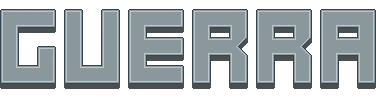

  

Hi there! I'm João Paulo Guerra, a Brazilian student of Internet Systems and a passionate developer.

My journey into programming started through game development at an early age, driven entirely by curiosity and passion. Over time, that interest expanded into software and web development, eventually bringing me here to GitHub.

Currently, I'm working on a web development project alongside some personal projects focused on programming, game development, and design.

Feel free to explore my repositories and check out more of my work through the link below.

## Languages & Frameworks

        

## Tools

    

<!--
**guerragdes/guerragdes** is a ✨ _special_ ✨ repository because its `README.md` (this file) appears on your GitHub profile.

Here are some ideas to get you started:

- 🔭 I’m currently working on ...
- 🌱 I’m currently learning ...
- 👯 I’m looking to collaborate on ...
- 🤔 I’m looking for help with ...
- 💬 Ask me about ...
- 📫 How to reach me: ...
- 😄 Pronouns: ...
- ⚡ Fun fact: ...
-->
